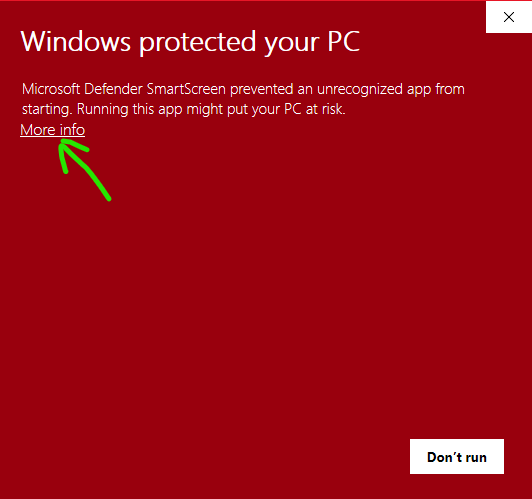

# CPS-billing-bot-go

## Instructions

- Download the exe:
  - https://github.com/jay13jay/CPS-billing-bot-go/raw/main/bin/main.exe
- Run the file
- A CLI window will open, asking for your GUID
  - You can find your GUID by logging into your CPS account
  - the URL should look similar to the following:
    ```
    https://cps.opower.com/ei/edge/apis/DataBrowser-v1/cws/utilities/cps/utilityAccounts/YOURGUIDHERE 
    ```
  - Grab whatever is under YOURGUIDHERE and put it into the CLI prompt


## Notes
- This is a very early version of this code, I can make no guarantees to the functionality now or in the future
- That being said, if you do have an problem, or question, feel free to create an issue on github
- If you need direct feedback, you can email me at: jhaxllc@gmail.com
  - Please note I do not check this email everyday but I will try to respond as quickly as possible

- A major note: Windows WILL warn you that you are running the file, it will do this anytime you run an executable you downloaded you will see an error such as the one in the image below.
  - To run, first click more info
    
  - After more info, you should have two boxes, "Run Anyway" or "Don't Run". To run the file, click "Run Anyway"
    
  - The next time you run the file, you should not get any warnings, however if you download any updates it's possible this may happen again
  - Yes I plan on fixing this issue eventually but as it stands this is a one off script, not for mass public distribution